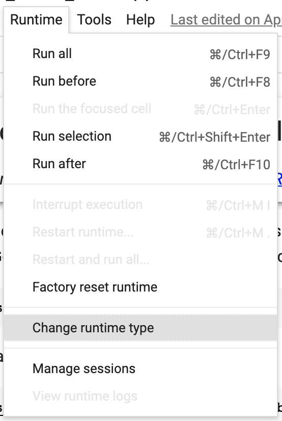
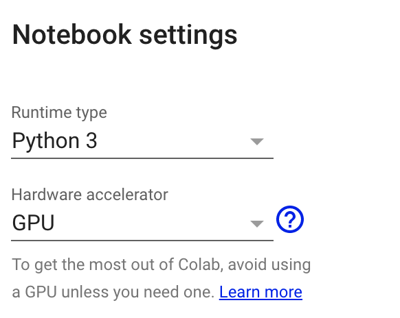
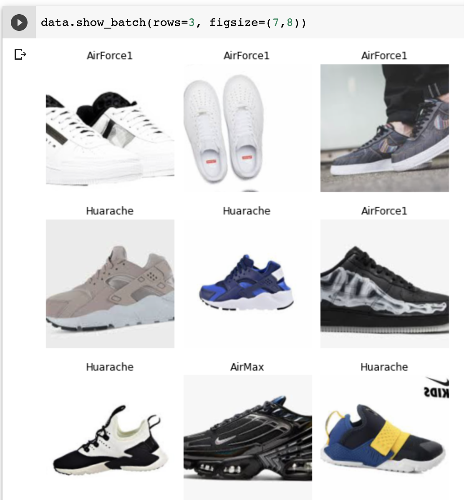
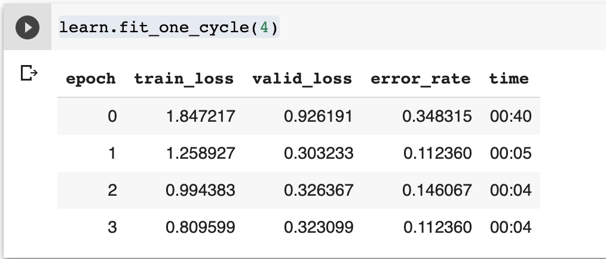
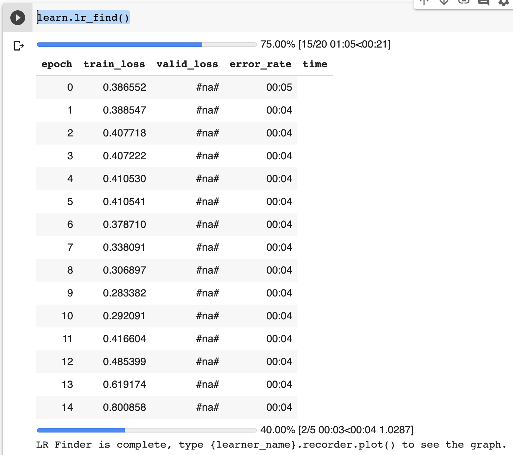
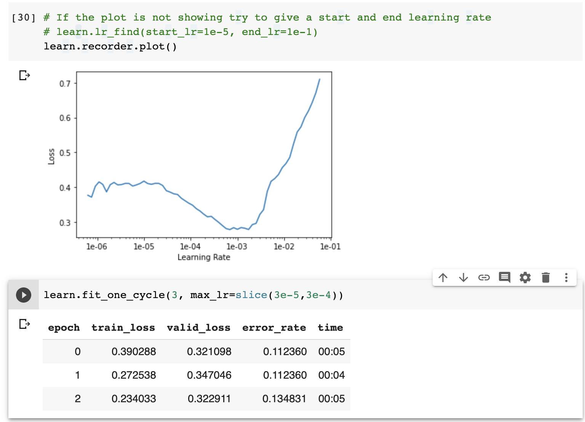
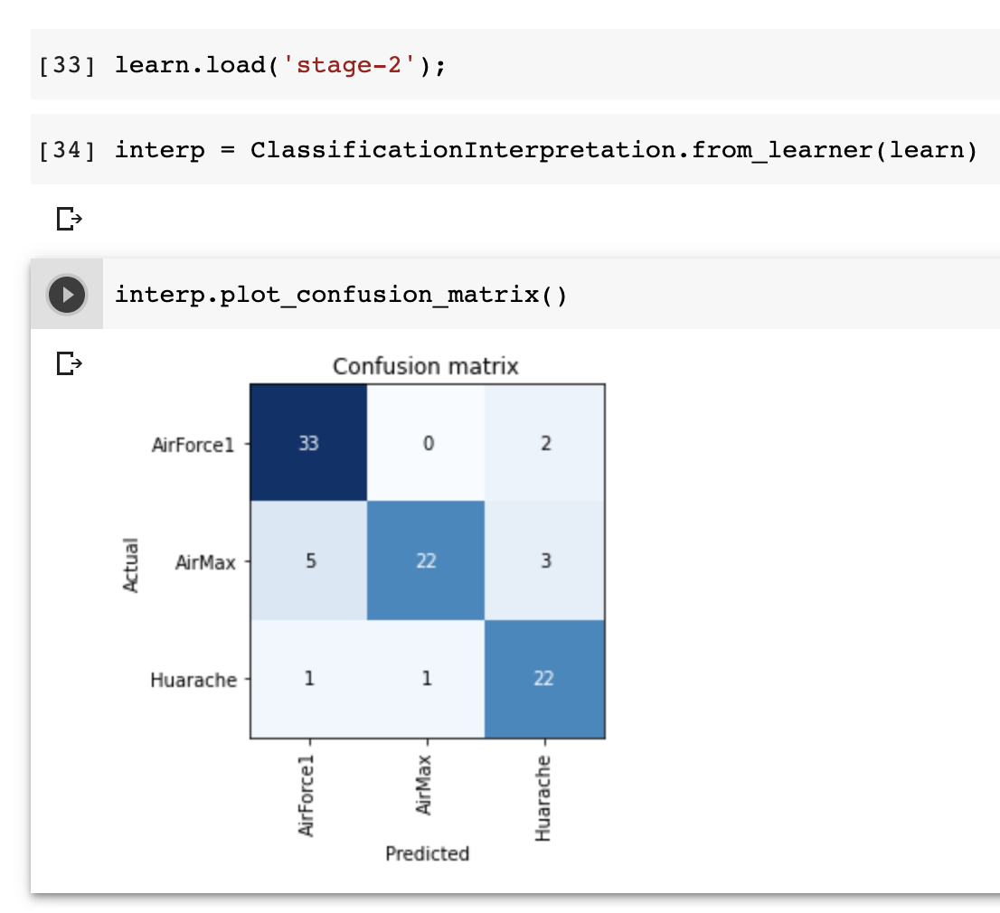
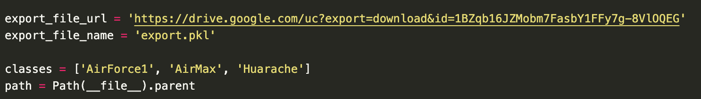
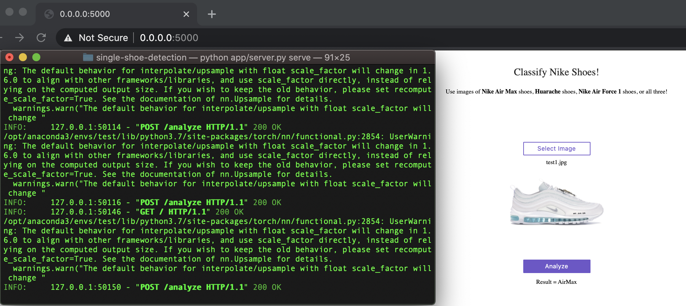

# Introduction to Deep Learning with Fast AI - Single Object Detection

Before the team made the transition to multiple object detection, Ronak was researching Fast.AI - a tool built on PyTorch for advanced machine learning application. Fast AI is an incredibly useful tool and enables people to do data science in relatively few lines of code. It's meant for people to practically apply advanced deep learning tools. 

The great part about Fast AI is that most of the tools/tutorials written for it are in the jupyter notebook format, which allows you to write documentation and experiment with code in a neat, intuitive manner. In order to run jupyter notebook, you can go to terminal and type in ```jupyter notebook```. Then, navigate to the directory that contains the ```.ipynb``` file that you're interested in and click on it. It should run a jupyter notebook that lets you interactively run code. 

While I have run my code locally, I highly suggest that we use Google Colab (which offers free GPU services) for running code related to Fast AI. This is because it offers free GPU and it's also what I have written this tutorial in. Therefore, if trying to replicate my results, it may be difficult to do so locally. I will write the code assuming that one will use Google Colab. 

## Running Fast AI & Building Custom Model via Google Colab 

### The First (CRUCIAL) Step - Setting up Colab

The first step is to actually register your stuff properly to access Colab. This requires you to have a gmail account. I ended up utilizing my Harvey Mudd email credentials. The next step is to head to the [Colab Welcome Page](https://colab.research.google.com/notebooks/welcome.ipynb#recent=true) and import from Github (you need to input ```fastai/course-v3```). If you do this method, you're installing the FastAI python notebook; however, I suggest you actually upload the one that I built because it has more instructions and is specific to the project. Therefore, head to the Colab Welcome Page and upload the ```.ipynb``` file called ```CustomClassifier_Ronak_FastAI.ipynb```. Now, the python notebook should be displayed. 

Before running anything, however, you need to tell Google Colab that you're interested in using a GPU. You can do this by clicking the runtime tab, selecting "change runtime time," and clicking GPU! See the screenshots below for more clarity. 

Finding the setting option to change to GPU:


The actual settings you want (make sure to hit save):



For any more clarity about the above steps, I suggest reading Fast.AI's documentation [here](https://course.fast.ai/start_colab.html).

## Explanation of Code in the Jupyter Notebook

In the Jupyter Notebook, I edited some of the code (and there exists explanation in the file itself). The first step of the code is to run import statements that allow you to use Fast AI in Google Colab. To run code in Google Colab, simply click the ```play``` button that's to the left of each code block. 

The code starts by importing the Fast.AI library, updating the software, and allowing Google to access data on Google Drive. This is the code to do so:

```python
from google.colab import drive
drive.mount('/content/gdrive', force_remount=True)
root_dir = "/content/gdrive/My Drive/"
base_dir = root_dir + 'fastai-v3/'
```
This will require you to enter an authorization code (which you get by visiting a specific URL provided after you run the command). I created a directory in Google Drive called ```fastai-v3``` that would contain all my work. This allows your Jupyter Notebook file to access that repository. 

The next step is acquiring information from Google Images. This is done by pasting the following code into the brower's console after scrolling through Google Images:

```javascript
urls=Array.from(document.querySelectorAll('.rg_i')).map(el=> el.hasAttribute('data-src')?el.getAttribute('data-src'):el.getAttribute('data-iurl'));
window.open('data:text/csv;charset=utf-8,' + escape(urls.join('\n')));
```

The next step is creating directories and uploading the URLs of the photos from Google Images into the server. All this is explained in the Python Notebook. The important part is that by "you will need to run this cell once per each category," it means that you need to run a folder cell, then the path cell code, then another folder cell, then the path folder cell, then the path cell code, and the path folder cell. There is then code to download the images from the URLs to the file paths created, removing images that can't be opened, and viewing the data. 

If everything goes well, by the time you reach the ```data.show_batch(rows=3, figsize=(7,8))``` cell, you would get the following output:



The next step is training the model, which utilizes transfer learning via the Resnet34 model. The code will run ```fit_one_cycle```, which fits the model by using large, cyclical learning rates to train models quickly with higher accuracy. Cyclical learning rates are a method to let the learning rate continuously oscillate between reasonable bounds. We then save this to a stage, freeze the model, and check out our results. If things work correctly, we have the following:



Next is running ```lr_find``` which explores the learning rate to fit the optimal rate. You then plot this learning rate and see where you get the least amount of loss - which for me is usually between ```3e-5 and 3e-4```. You input that information into another call to fit_one_cycle. This will look like:



And like this, respectively:



You'll then be able to interpret your results like the following:



The next step is cleaning up the code (e.g. removing images, prune top losses). The code will walk you through deleting duplicates in the code. Once this step is completed, the model can be put into production. The command ```learn.export()``` enables you to export the content of the learner object for production as a ```export.pkl``` file. You can then create a routing for web applications to utilize this app. Now, this bring us into using the code written for Nike shoes and the stuff that's currently in the current repository. 

## Deploying the Code That's In The Repository

This repo can be used as a starting point to deploy [fast.ai](https://github.com/fastai/fastai) models on Render. Render is one way to host the ```.pkl``` files on the web; it's a fast and quick way to test deployment (and doesn't require money initially). The first step is uploading the .pkl file on Google Drive and making the link publicly accessible. This is accomplished by using the following website: https://www.wonderplugin.com/online-tools/google-drive-direct-link-generator/. Now, before I continue, it's probably best that you run stuff locally before running it through Render. If you insist on running through Render, I'd continue with the tutorial/guide linked below to Fast AI's blog. I will continue writing if I were to run locally. 

To continue with running things locally, you should run the following commands in terminal: 

```python3.7 -m pip install aiohttp``` 
```pip install uvicorn```
```pip install torch torchvision```
```sudo pip install http://download.pytorch.org/whl/cpu/torch-1.0.0-cp36-cp36m-linux_x86_64.whl```
```sudo pip install fastai```
```pip install starlette```
```pip install aiofiles```
```pip install python-multipart --user```

If there are still issues, it's because of problems with PyTorch and OSX. Try installing FastAI via Anaconda:

```conda install -c pytorch -c fastai fastai jupyter```

If you're getting issues regarding permissions, try running the pip command again with the ```--user``` tagline! 

Now, edit the file server.py inside the app directory and update the export_file_url variable with the URL from the Google Drive download link. In the same file, update the line classes = ['black', 'grizzly', 'teddys'] with the classes you expect from your model. Your code should look something like this: 



Now, run the following code and head to ```http://0.0.0.0:5000/```:

```python app/server.py serve```

If everything goes well, your code should look like the following: 



The guide for production deployment to Render is at https://course.fast.ai/deployment_render.html if my guide isn't helpful. 
